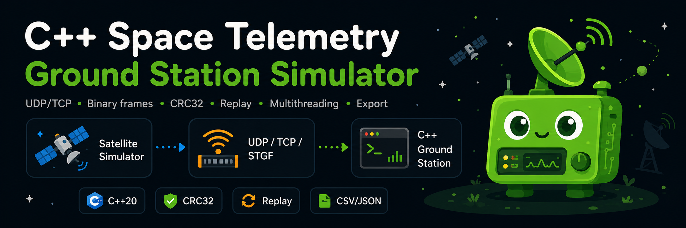

# C++ Space Telemetry Ground Station



A C++20/Linux telemetry ground-station showcase built to demonstrate robust systems programming: binary protocols, CRC validation, TCP stream framing, UDP datagrams, bounded multithreaded pipelines, deterministic ordering, replay files, local port diagnostics, typed application payloads, signal processing, tests, sanitizers and terminal-oriented observability.

> This is an educational/portfolio project. It deliberately borrows concepts from telemetry systems, but it is **not** flight software, a CCSDS implementation or a qualified ground segment.

## Highlights

- Strict STGS v1 binary wire format with derived field offsets and bounded payloads.
- CRC-32/ISO-HDLC with the exact polynomial and parameters documented in code.
- UDP reception with oversize-datagram detection via `MSG_TRUNC`.
- Multi-client TCP reception using `poll()`, per-client framing and resynchronization.
- TCP handling designed around a stable `pollfd` snapshot to avoid client/index desynchronization.
- Bounded producer/consumer queues for explicit backpressure.
- Parallel decode workers followed by sequence reordering, so CSV/JSON and health history remain deterministic regardless of worker count.
- STGF capture/replay using the exact original wire frames.
- STGA typed payload layer for text messages and sampled signals without changing the STGS v1 outer frame.
- Noisy sine-wave generation plus moving-average or sine/cosine projection filtering.
- ANSI/Unicode terminal UI with automatic TTY detection, `NO_COLOR` support and ASCII fallback.
- Local-only TCP port diagnostics and automatic bounded port selection/discovery.
- Sliding-window `NOMINAL`/`DEGRADED` health monitor with hysteresis.
- Strict CLI parsing: no silent suffixes, truncation, NaN or infinity.
- GCC/Clang warning-clean builds, 20 unit/loopback integration tests, ASan/UBSan/TSan support and reproducible benchmark tooling.

## Requirements

- Linux/POSIX environment.
- CMake 3.16+.
- C++20 compiler (GCC or Clang).
- pthreads.
- Python 3 is used only by one CI JSON validation command; the C++ applications themselves have no Python runtime dependency.

## Build

CMake is the source of truth:

```bash
cmake -S . -B build -DCMAKE_BUILD_TYPE=Release
cmake --build build -j
ctest --test-dir build --output-on-failure
```

A developer-friendly Makefile wraps the common commands:

```bash
make build
make test
make asan-test
make tsan-test
make benchmark
make help
```

## 1. Live TCP telemetry

Terminal 1:

```bash
./build/stgs_ground_station \
  --tcp \
  --port 9000 \
  --decoder-threads 4 \
  --output telemetry.csv
```

Terminal 2:

```bash
./build/stgs_satellite_simulator \
  --tcp \
  --host 127.0.0.1 \
  --port 9000 \
  --count 1000 \
  --rate 500
```

TCP is a byte stream, not a message transport. `StreamFrameExtractor` therefore buffers fragments, accepts multiple frames in one `recv()`, and resynchronizes on the `STGS` magic when noise or malformed lengths are encountered. During an active stream, the ground station also emits a throttled `pipeline` status line (about once per second when counters change) showing reception, decode, rejection, write and queue occupancy without flooding the terminal.

## 2. Automatic local port selection and diagnostics

The ground station can select the first bindable TCP port in a bounded range:

```bash
./build/stgs_ground_station \
  --tcp \
  --bind 127.0.0.1 \
  --auto-port 9000:9010 \
  --output telemetry.csv
```

Inspect all listeners in the same local range:

```bash
./build/stgs_port_check \
  --host 127.0.0.1 \
  --ports 9000:9010 \
  --timeout-ms 200
```

Or let the simulator probe the range and use the first reachable TCP listener:

```bash
./build/stgs_satellite_simulator \
  --tcp \
  --host 127.0.0.1 \
  --discover-ports 9000:9010 \
  --count 100
```

The diagnostic is intentionally restricted to IPv4 loopback and at most 256 ports. `OPEN` means that a TCP listener completed the connection; STGS v1 is unidirectional and has no application handshake, so the tool does **not** claim to authenticate the remote service as STGS.

## 3. Send and display a text message

Start a listening station, for example with `--auto-port 9100:9105`, then send a typed STGA message:

```bash
./build/stgs_satellite_simulator \
  --tcp \
  --host 127.0.0.1 \
  --discover-ports 9100:9105 \
  --message "Bonjour depuis STGS" \
  --count 1
```

The ground station decodes the outer STGS frame, validates its CRC, then interprets the inner STGA payload and displays a line such as:

```text
[MESSAGE] sat=42 seq=0 text="Bonjour depuis STGS"
```

Remote control characters are escaped before display so a received message cannot directly inject ANSI terminal control sequences.

## 4. Send a noisy wave and filter it

Terminal 1:

```bash
./build/stgs_ground_station \
  --tcp \
  --port 9000 \
  --signal-filter sine-projection \
  --output telemetry.csv
```

Terminal 2:

```bash
./build/stgs_satellite_simulator \
  --tcp \
  --host 127.0.0.1 \
  --port 9000 \
  --signal \
  --sample-rate 200 \
  --signal-frequency 5 \
  --signal-amplitude 1.0 \
  --signal-samples 256 \
  --noise-stddev 0.35 \
  --count 5 \
  --rate 2 \
  --seed 1234
```

The terminal renders raw and filtered sparklines plus RMS, residual-noise RMS, estimated amplitude and an approximate SNR.

Two different perturbations are deliberately separated:

- `--noise-stddev` adds Gaussian noise to the **signal samples before encoding/CRC**. The frame remains valid and the DSP stage must recover the useful component.
- `--corrupt <p>` modifies encoded bytes **after CRC generation**. This simulates transport/storage corruption and is expected to produce CRC or structural rejection.

The sine-projection filter estimates DC plus sin/cos coefficients at the known nominal frequency. It is intentionally understandable and dependency-free; it is not presented as an RF receiver or flight-qualified DSP implementation.

## 5. UDP telemetry

Terminal 1:

```bash
./build/stgs_ground_station --udp --port 9000 --output telemetry.csv
```

Terminal 2:

```bash
./build/stgs_satellite_simulator \
  --udp --host 127.0.0.1 --port 9000 --count 1000 --rate 500
```

One UDP datagram is one candidate STGS frame. Oversized datagrams are detected rather than silently interpreted after truncation.

## 6. Capture and replay

Create an STGF capture:

```bash
./build/stgs_satellite_simulator \
  --output-file frames.stgf \
  --count 1000 \
  --rate 0 \
  --seed 424242
```

Replay it through the same validation/pipeline code:

```bash
./build/stgs_ground_station \
  --replay frames.stgf \
  --decoder-threads 8 \
  --output replay.csv
```

STGF stores complete original STGS wire frames, including their CRC. Frame lengths are validated before allocation on read and before write.

## 7. Deterministic multithreaded pipeline

The ground station assigns a monotonic sequence number before frames enter the decoder pool:

```text
network / replay
      |
      v
bounded raw queue
      |
      v
N decoder workers
(FrameCodec + CRC)
      |
      v
bounded decoded queue
      |
      v
sequence reorder stage
      |
      +--> health monitor
      +--> STGA message/signal processing
      +--> CSV / JSON writer
```

Decoder completion order is allowed to vary, but externally observable processing is restored to reception order. A replay exported with one worker and the same replay exported with multiple workers therefore remains deterministic.

## 8. Binary protocol: STGS v1

All integers are big-endian/network order.

```text
MAGIC | VERSION | SATELLITE_ID | TIMESTAMP_MS | TEMPERATURE_C |
BATTERY_PERCENT | STATUS | PAYLOAD_LEN | PAYLOAD | CRC32
```

| Field | Wire type | Notes |
| --- | --- | --- |
| `MAGIC` | `uint32` | ASCII `STGS`, `0x53544753` |
| `VERSION` | `uint8` | `1` |
| `SATELLITE_ID` | `uint16` | Logical source identifier |
| `TIMESTAMP_MS` | `uint64` | Unix epoch milliseconds |
| `TEMPERATURE_C` | IEEE-754 `float32` | Big-endian bit pattern |
| `BATTERY_PERCENT` | `uint8` | `0..100` |
| `STATUS` | `uint8` | NOMINAL/WARNING/CRITICAL/SAFE_MODE |
| `PAYLOAD_LEN` | `uint16` | Application limit: 4096 bytes |
| `PAYLOAD` | bytes | Opaque or STGA typed payload |
| `CRC32` | `uint32` | CRC-32/ISO-HDLC over every preceding frame byte |

The fixed header is derived from the field widths and locked with `static_assert`; offsets are not duplicated as unexplained literals.

### CRC parameters

The implementation uses CRC-32/ISO-HDLC:

- polynomial (normal representation): `0x04C11DB7`;
- reflected polynomial used by the LSB-first table: `0xEDB88320`;
- init: `0xFFFFFFFF`;
- refin/refout: true;
- xorout: `0xFFFFFFFF`;
- check vector `"123456789"`: `0xCBF43926`.

These values are named and documented in `include/stgs/Crc32.hpp` so `0xEDB88320` is not an unexplained magic number in the implementation.

## 9. Typed application payload: STGA v1

The STGS outer frame remains unchanged. Payloads that begin with ASCII magic `STGA` are interpreted by the application layer:

- `TEXT_MESSAGE`: logical message sequence + text bytes;
- `SIGNAL_BLOCK`: sample rate, nominal frequency/amplitude, absolute sample index and float samples.

A payload without `STGA` remains valid opaque telemetry, preserving compatibility with the original random-payload simulator and replay files.

## 10. Health monitoring

`StationHealthMonitor` evaluates a sliding window after deterministic reordering. By default:

| Setting | Default |
| --- | ---: |
| Window | 100 samples |
| Minimum observations | 20 |
| Rejection rate to degrade | 10 % |
| Rejection rate to recover | 3 % |
| Critical/SAFE_MODE count to degrade | 8 |
| Critical/SAFE_MODE count to recover | 3 |

The simulator's default status distribution contains roughly 3 % `CRITICAL + SAFE_MODE`. Keeping the degradation threshold above that expected demo background, with a separate recovery threshold, avoids the rapid state flapping produced by using a threshold near the mean.

All thresholds are CLI-configurable and are explicitly demonstration values, not mission or aerospace safety limits.

## 11. Testing and sanitizers

Run the dependency-free unit/integration suite:

```bash
make test
```

The suite covers, among other cases:

- standard CRC known vector;
- encode/decode round trip;
- bad magic/CRC/length rejection;
- TCP stream split/noise resynchronization;
- STGA text and signal round trips;
- signal projection recovery and invalid signal-metadata rejection (finite values/Nyquist);
- terminal ANSI-control sanitization;
- STGF bounds and round trip;
- health hysteresis;
- bounded-queue backpressure;
- loopback-only port diagnostics;
- real TCP loopback fragmentation followed by immediate peer close;
- cooperative `NetworkServer::stop()` while `poll()` is active;
- real UDP loopback reception.

The current suite contains **20 tests**. The network cases use real loopback sockets rather than mocks, so connection lifecycle, fragmentation, `POLLHUP`, bounded shutdown and UDP datagram semantics are exercised by the test binary.

Run ASan + UBSan:

```bash
make asan-test
```

Run ThreadSanitizer in a separate build:

```bash
make tsan-test
```

The sanitizers are intentionally separated because ASan and TSan cannot be combined in the same process. The TCP loopback integration test intentionally exercises the connection lifecycle that is easy to get wrong when a `pollfd` snapshot and a mutable client vector coexist. SIGINT/SIGTERM are also handled through a dedicated `sigtimedwait()` thread rather than an asynchronous signal handler, keeping the normal C++ shutdown path outside signal-handler context.

## 12. Benchmark

```bash
make benchmark
```

or directly:

```bash
./build/stgs_benchmark_decode \
  --frames 200000 \
  --payload-size 256 \
  --decoder-threads 4
```

See [`docs/PERFORMANCE_REPORT.md`](docs/PERFORMANCE_REPORT.md). Thread count is not assumed to improve small-frame throughput: synchronization overhead can dominate, which is why the project benchmarks rather than asserting scalability.

## Project layout

```text
.
├── apps/
│   ├── ground_station.cpp
│   ├── port_check.cpp
│   └── satellite_simulator.cpp
├── benchmarks/
│   └── benchmark_decode.cpp
├── docs/
│   ├── PERFORMANCE_REPORT.md
│   ├── SHOWCASE_GUIDE.md
│   ├── TECHNICAL_DESIGN.md
│   └── VERIFICATION_REPORT.md
├── include/stgs/
│   ├── ApplicationPayload.hpp
│   ├── BlockingQueue.hpp
│   ├── ByteUtils.hpp
│   ├── CliParsing.hpp
│   ├── Crc32.hpp
│   ├── FrameCodec.hpp
│   ├── Logger.hpp
│   ├── NetworkServer.hpp
│   ├── PortDiagnostics.hpp
│   ├── Replay.hpp
│   ├── SignalProcessing.hpp
│   ├── StationHealth.hpp
│   ├── TelemetryFrame.hpp
│   └── TerminalUi.hpp
├── src/
├── tests/
├── CMakeLists.txt
└── Makefile
```

## Design principles visible in the code

- **Explicit invariants:** field widths, CRC parameters and protocol limits are named.
- **Expected bad input is data:** malformed frames return structured `FrameError` values rather than using exceptions as normal flow control.
- **Exceptions for exceptional failures:** invalid configuration, socket setup and file I/O failures abort with clear diagnostics.
- **RAII:** sockets/files are closed on normal paths and exceptions.
- **Bounded memory:** payload sizes, queues, replay lengths and port-diagnostic ranges are bounded.
- **Determinism:** concurrency may reorder completion internally, never the final exported stream.
- **Observability:** startup stages, network events, health transitions, messages, signals and summaries are visible in the terminal.
- **Honest scope:** the code explains where a number is a protocol constant, a numerical choice or simply a demonstration default.

## License

MIT. See [`LICENSE`](LICENSE).
